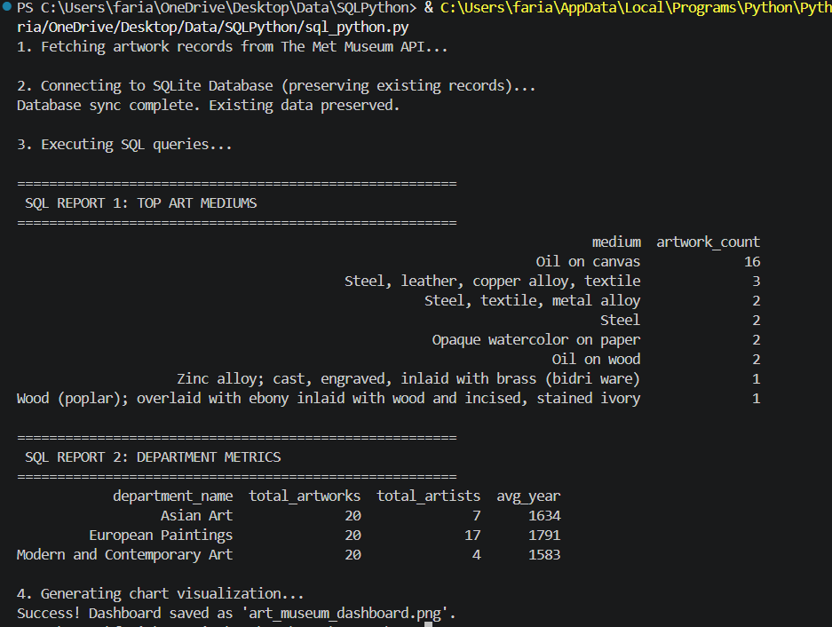
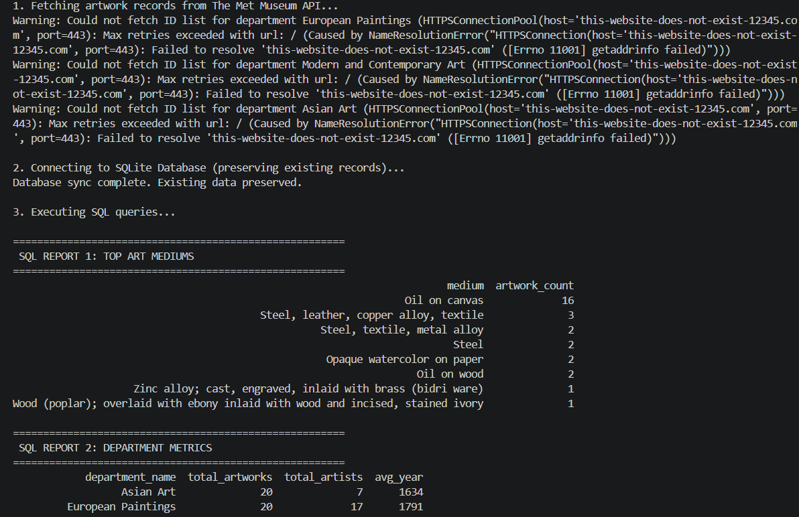

# Met Museum SQL & Data Analysis

A Python data analysis project that retrieves artwork records from The
Metropolitan Museum of Art Collection API, stores the data in a
relational SQLite database, analyzes it using SQL and Pandas, and
generates visualizations.

## What This Project Does

The application:

-   Fetches artwork data from The Met Museum API
-   Collects artwork, artist, department, creation year, medium, and
    country or culture information
-   Stores the data in a SQLite relational database
-   Uses SQL queries to analyze the collection
-   Uses Pandas to process and report query results
-   Generates visualizations showing artwork mediums and historical
    distribution

## Data Pipeline

**The Met Museum API**\
↓\
**Artwork Data**\
↓\
**SQLite Database**\
↓\
**SQL Queries**\
↓\
**Pandas Analysis**\
↓\
**Visualizations**\
↓\
**Reports + Dashboard**

## Database Structure

The SQLite database contains three related tables:

### Departments

Stores:

-   Department ID
-   Department name

### Artists

Stores:

-   Artist name
-   Artist biography

### Artworks

Stores:

-   Object ID
-   Artwork title
-   Artist
-   Department
-   Creation year
-   Medium
-   Country or culture

The database uses primary keys and foreign keys to maintain
relationships between the tables.

## SQL Analysis

The project uses SQL to analyze the stored artwork data.

The queries calculate:

-   Most common artwork mediums
-   Number of artworks created by century
-   Total artworks by department
-   Number of distinct artists by department
-   Average creation year by department

SQL techniques demonstrated include:

-   SELECT
-   WHERE
-   JOIN
-   GROUP BY
-   ORDER BY
-   COUNT
-   COUNT DISTINCT
-   AVG
-   LIMIT

## Visualizations

The project generates a dashboard containing:

-   Top artwork mediums
-   Number of artworks created per century

### Dashboard

### API Failure Test

## Error Handling

The application includes checks for:

-   API connection failures
-   Invalid or unreachable API URLs
-   Failed artwork requests
-   Missing artwork information
-   Invalid creation years
-   Duplicate database records
-   Existing database records

API failures are reported as warnings while allowing the program to
continue processing available data.

## Technologies Used

-   Python
-   SQLite
-   SQL
-   Requests
-   Pandas
-   Matplotlib
-   The Metropolitan Museum of Art Collection API

## Output

The program generates:

-   art_museum.db
-   art_museum_dashboard.png

The SQLite database stores the collected artwork data, while the
dashboard visualizes the SQL analysis results.

## How to Run

Install the required packages:

pip install pandas matplotlib requests

Run the application:

python sql_python.py

The program will fetch artwork records, synchronize the SQLite database,
execute SQL queries, display analysis reports, and generate the
dashboard.

## Data Source

[The Metropolitan Museum of Art Collection
API](https://metmuseum.github.io/)

## Skills Demonstrated

-   Python programming
-   REST API integration
-   JSON data handling
-   SQLite databases
-   Relational database design
-   SQL queries
-   Primary and foreign keys
-   JOIN operations
-   Data aggregation
-   Pandas data processing
-   Data analysis
-   Data visualization
-   Exception handling
-   Database persistence
-   File output
